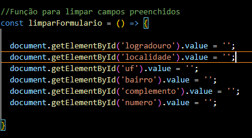
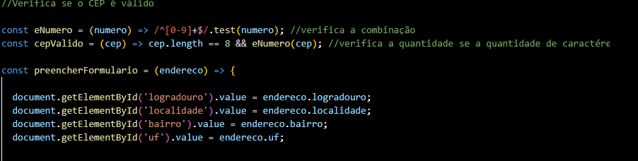
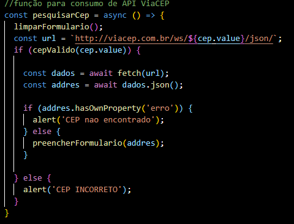
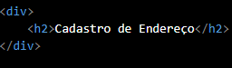
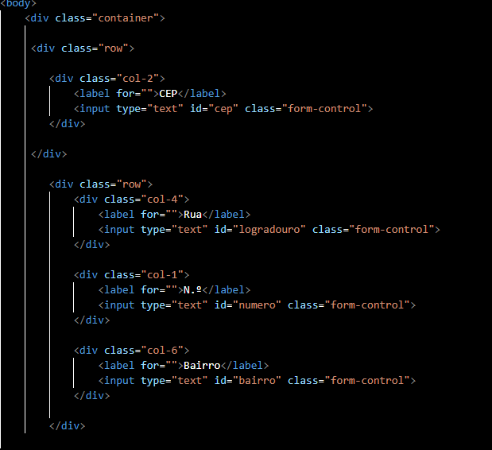
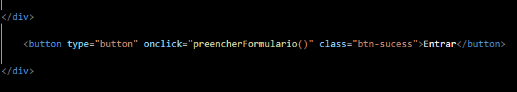
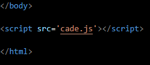
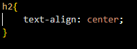
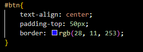
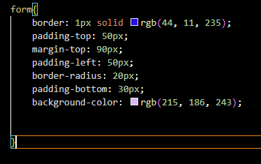

 # PROJETO DE CADASTRO DE ENDEREÇO COM CONSUMO DE API(ViaCEP)

 **Nesse projeto que realizamos com o professor Léo fizemos um codigo de cadastro de endereço, que colocamos o nosso cep e aparece diretamente a nossa rua, bairro ou ate mesmo o numero da casa**
 ## js

> **limpar formulario**

  

 Limpa os campos do formulário relacionados ao endereço, removendo valores anteriores.

> **verifica se o cep é valido**

 

 Verifica se uma string contém apenas números.

> **função para consumo de API ViaCEP**

  

  Confirma se o CEP tem exatamente 8 dígitos e é composto apenas por números.

## html

**cadastro de endereço**

 

Este código HTML cria uma página de cadastro de endereço. Ele inclui:
Título: "Cadastro de Endereço".

**links**

 

 Links: Conecta um arquivo CSS externo (main.css) e uma folha de estilo do Bootstrap

 **campo de formulario**

 

 Campos de Formulário: CEP, rua, número, bairro, complemento, cidade, e estado, organizados em linhas e colunas usando o Bootstrap.

 **botão**

 

 Botão: Um botão para enviar os dados, que chama a função preencherFormulario() ao ser clicado.

**script**

Script: Um arquivo JavaScript (cade.js) é vinculado para manipular a lógica do formulário.

## css

**h2**

h2: Centraliza o texto no elemento 

**btn**

btn (botão com ID btn): Centraliza o conteúdo, adiciona espaçamento superior de 50px e aplica uma borda na cor blueviolet.
 
 **form**

form: Aplica uma borda roxa escura, arredonda os cantos, define espaçamentos internos (50px no topo e esquerda, 30px na parte inferior) e externo (90px no topo), e define um fundo lilás claro.
 

